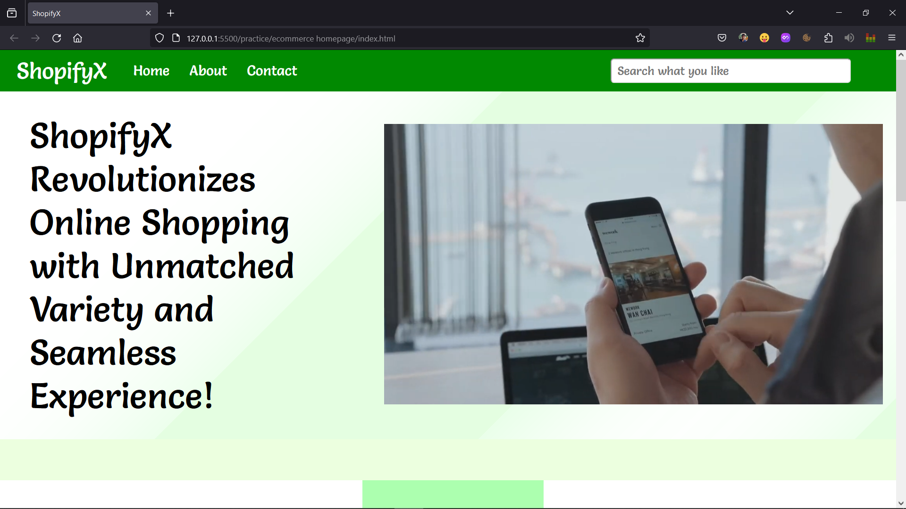
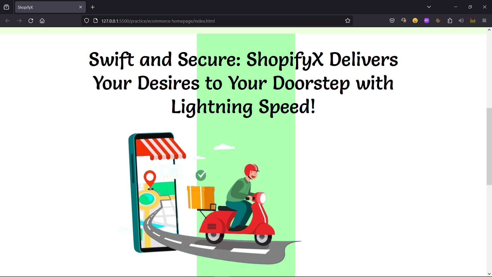
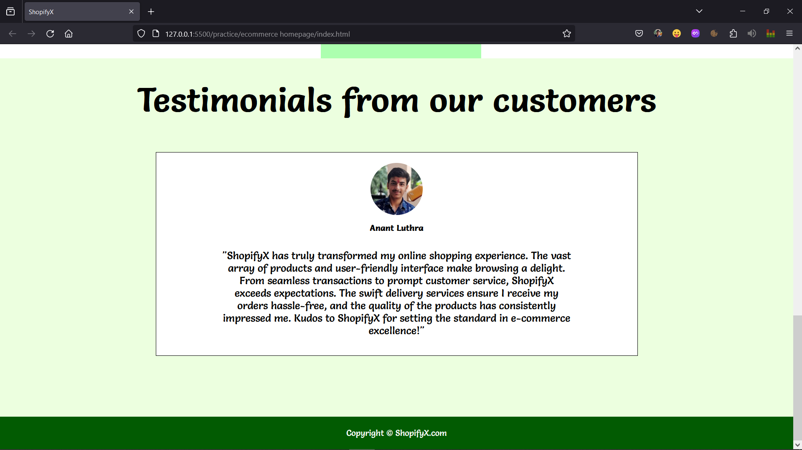

# E-commerce homepage

This is an sample E-commerce website for a brand known as ShopifyX, I made it using just `html` and `css`, it is kinda basic because it's my first project which i made, but still i tried my best.
- My tweet of [#100daysofcode](https://twitter.com/anant_luthra_/status/1741750511681081492) in which i presented responsiveness, here is the link [🔗](https://twitter.com/anant_luthra_/status/1748401881276416489)

## Previews

---

---

---

## Below is a GIF of overall view of website

    

 

### GIF's link if not visible [🔗](./files/preview.gif)